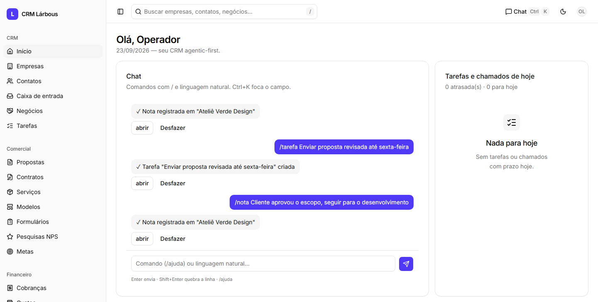
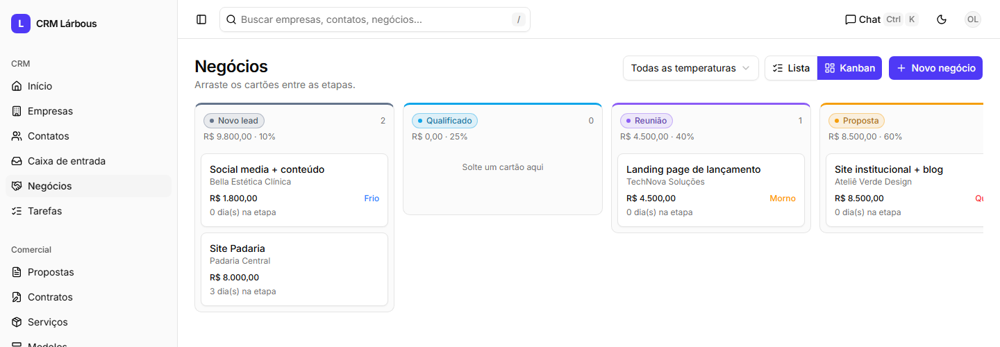
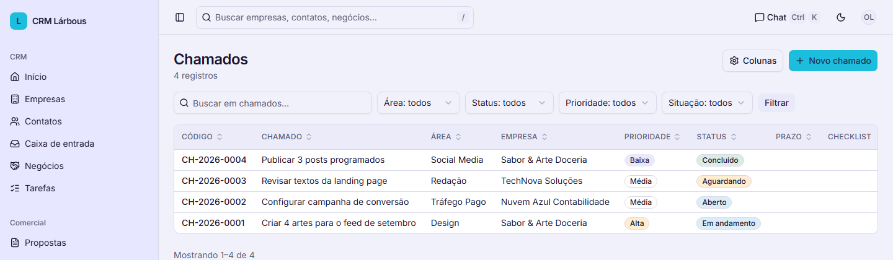

# CRM Lárbous

**Um CRM que você opera por chat, com agentes de IA embutidos — e que sobe em qualquer hospedagem PHP só de copiar a pasta.**


> Toda a interface e a documentação são em português do Brasil (é um CRM feito para agências e times brasileiros). Pull requests com comentários e descrições em inglês são muito bem-vindos — este README explica o suficiente para você navegar pelo código mesmo sem ler português fluentemente.

---

## Capturas de tela

| Dashboard + chat | Kanban de negócios | Chamados por área |
|---|---|---|
| [](docs/capturas/dashboard.png) | [](docs/capturas/kanban.png) | [](docs/capturas/chamados.png) |

*(Dados de exemplo fictícios, gerados só para esta captura.)*

---

## O que é isso

CRM Lárbous é um CRM completo — empresas, contatos, negócios, kanban, propostas, contratos, tarefas, cobranças — nascido dentro de uma agência web de verdade, para um único operador rodar a empresa inteira sem precisar contratar um time de vendas para alimentar planilhas.

Ele se destaca por dois motivos, e não só um:

- **É genuinamente fácil de colocar no ar.** Sem Composer, sem npm, sem build no servidor, sem precisar de SSH. Copie a pasta para qualquer hospedagem PHP, abra no navegador e uma tela de instalação cria o banco e o seu usuário sozinha — [veja "Começando"](#começando).
- **A IA é um cidadão de primeira classe da arquitetura**, não um chatbot colado por cima. Com regras de segurança tão rígidas quanto as de um formulário HTML. Você pode:
  - Abrir uma tela e cadastrar tudo à mão, como em qualquer CRM;
  - Digitar `cria negócio de 8 mil pro site da Padaria Central, contato Ana` no chat e ver o negócio aparecer;
  - Acionar um **agente** (`@qualificador`) para avaliar um lead e devolver um diagnóstico pronto para aprovação;
  - Deixar um **squad** (uma sequência de agentes) rodar sozinho toda vez que um negócio é ganho, um contrato é assinado ou um formulário do site é enviado.

E em nenhum desses caminhos a IA toca o banco de dados diretamente. Mais sobre isso abaixo.

## Para quem é

- **Agências e pequenos times comerciais** (o caso de uso original: um operador só, cuidando de vendas, atendimento e financeiro).
- **Desenvolvedores curiosos sobre "IA agêntica"** que querem ver um exemplo real, rodando em produção, de como dar superpoderes de IA a um sistema sem abrir mão de auditoria, permissões e previsibilidade.
- **Quem precisa de um CRM sem vendor lock-in**: seu banco é um arquivo SQLite. Seus dados nunca saem do seu servidor, exceto quando você mesmo pluga um provedor de IA ou uma integração (WhatsApp, e-mail, Asaas).

## Por que "agentic-first"

A maioria dos produtos "com IA" hoje é um recurso a mais dentro de um sistema tradicional. Aqui a ordem é invertida: o sistema foi desenhado desde o primeiro dia para que **humano, chat, agente e formulário público escrevam dados pelo mesmo caminho, com as mesmas regras**.

```
Tela (CRUD humano) ──────────────────► Controllers ─► ActionExecutor ─► Repositories ─► SQLite
                                                          │  ├─► Auditoria (com Desfazer)
Chat ─► Comando "/" (sem IA) ─────────────────────────────┤  └─► Eventos ─► Squads/Agentes (fila)
    └─► Roteador de linguagem natural (1 chamada de IA) ──┤
                     └─► Agente / Squad ───────────────────┘ (ou fila de aprovação)

Formulário público ─► ActionExecutor
cron (1×/min) ─► worker.php ─► fila de execuções, agendamentos, tarefas recorrentes, avisos
```

As regras que tornam isso seguro (e que valem a pena conhecer antes de mexer no código):

1. **A IA nunca escreve SQL nem toca no banco.** Ela só devolve JSON. O servidor valida esse JSON contra uma *whitelist* de entidades, campos e operadores (`Services/Schema.php`) antes de gravar qualquer coisa.
2. **Existe um único portão de escrita**: `Services/ActionExecutor.php`. Não importa se o pedido veio de um formulário HTML, do chat, de um agente ou de um webhook — todos passam por ele, que valida, grava, registra em auditoria e dispara eventos.
3. **Toda ação é auditada e pode ser desfeita.** Um clique (ou o comando `/desfazer`) reverte a última alteração — criar vira arquivar, atualizar volta ao valor anterior, arquivar reabre o registro.
4. **Agentes só fazem o que a definição deles permite.** Cada agente é um JSON com `acoes_permitidas`, `campos_gravaveis` e um `confianca_minima`: abaixo do corte de confiança, ou fora da lista de campos, a ação vai para uma fila de aprovação humana — mesmo que o agente esteja configurado para rodar sem aprovação.
5. **Failover entre provedores de IA** (Anthropic → Gemini) com disjuntor, orçamento de tempo e teto de execuções por hora — para nada travar o operador se um provedor cair.

## Principais recursos

### CRM
- Empresas, contatos e negócios com campos extras configuráveis por tela (sem tocar em código);
- Kanban de negócios com arrastar e soltar, temperatura do lead calculada por metodologia CHAMP;
- Timeline unificada de atividades, tarefas e anexos por registro;
- Busca global, colunas configuráveis, filtros e auditoria com Desfazer em qualquer tela.

### Comercial
- Catálogo de serviços, propostas com itens e totais em tempo real, contratos a partir de modelo;
- Link público de proposta e de contrato, com aceite e assinatura eletrônica simples (nome, documento, IP);
- Motor de variáveis (`{empresa.nome_fantasia}`, `{negocio.valor_estimado}`...) para gerar documentos a partir de modelos;
- Formulários de captação embutíveis em qualquer site, com detecção de duplicado e disparo automático de squads.

### Chat e IA
- Comandos diretos (`/nota`, `/tarefa`, `/desfazer`...), sem gastar uma chamada de IA;
- Linguagem natural roteada por IA (uma chamada por mensagem, sem histórico de conversa — o contexto é o registro aberto na tela);
- **9 agentes prontos** na biblioteca (qualificador de leads, redator de contratos e follow-ups, montador de propostas, pesquisador com busca na web, analista de pipeline...);
- **6 squads prontos** que encadeiam agentes em processos completos (`novo-lead`, `negocio-ganho`, `contrato-assinado`, `revisao-semanal`...);
- Ações rápidas de IA em qualquer campo de texto longo (melhorar texto, mudar o tom, resumir histórico, sugerir resposta).

### Atendimento
- Caixa de entrada unificada: WhatsApp e Instagram (Cloud API oficial da Meta) e e-mail (IMAP/SMTP próprios, sem extensões);
- Transcrição de áudios recebidos com intenção e sentimento (Gemini), resumo automático ao encerrar o atendimento;
- Cadência de follow-up e alerta de risco de churn (cliente ou chamado parado) gerados sozinhos pelo worker.

### Financeiro
- Cobranças avulsas e recorrentes integradas ao [Asaas](https://www.asaas.com) (boleto, Pix, cartão), com status sincronizado por webhook;
- Lançamento de custos por cliente e **DRE por cliente** (receita − custo = margem) calculado sob demanda;
- **Despesas da estrutura** (aluguel, software, impostos...): contas a pagar simples, por categoria, com meio (Pix, boleto, cartão...) e forma de pagamento (à vista, parcelado, recorrente) e alerta de vencidas; importação do histórico por planilha (CSV do Google Planilhas ou Excel) com modelo pronto.

### Operação
- Chamados internos por área (tráfego pago, design, social media, web, redação) com checklist de execução;
- Metas comerciais com progresso e ritmo esperado; NPS com link individual e tabulação automática;
- Painel de execuções de IA com tokens consumidos, útil para controlar custo.

## Como funciona por dentro

Sem framework, de propósito. `App\` mapeia direto para `/app` por um autoloader PSR-4 de umas 20 linhas. Isso significa:

- **Zero dependências para instalar.** Sem Composer, sem npm, sem build no servidor. Copie a pasta e suba com qualquer PHP 8.2+.
- **Roda em hospedagem compartilhada comum.** SQLite + cron de 1 minuto é tudo que o servidor precisa saber fazer.
- **Se instala sozinho.** A primeira requisição cria o banco e aplica o seed padrão; falta só criar o primeiro usuário por uma tela — nada de terminal.
- **Frontend sem framework de JavaScript**: HTML renderizado em PHP, JavaScript vanilla em módulos ES, visual [shadcn/ui](https://ui.shadcn.com) portado para HTML puro pelo [Basecoat](https://basecoat.dev), com Tailwind CSS v4 compilado antes do commit (o CSS final é versionado — o servidor nunca compila nada).
- **SQL só existe em um lugar**: a pasta `/app/Repositories`, sempre com prepared statements.

```
/app
  /Core            Router, DB, Auth, View, Validator, Csrf, Session, Response, Helpers
  /Controllers     controladores finos: validam, chamam Service/Repository, devolvem view ou JSON
  /Repositories    único lugar com SQL
  /Services
    ActionExecutor.php   único portão de escrita de dados (humano, chat, agente, formulário)
    Audit.php, Events.php
    /AI            Client, roteador de linguagem natural, execução de agentes e squads
  /Views           templates PHP + componentes reutilizáveis (Basecoat)
/library           agentes e squads da biblioteca inicial (*.agent.json, *.squad.json)
/migrations        migrações SQL numeradas, nunca editadas depois de aplicadas
/cron              worker.php, executado a cada minuto
/tests             suíte própria em PHP puro (sem PHPUnit) — php tests/run.php
/docs              SPEC.md (especificação completa) e ROADMAP.md (progresso por fase)
```

## Começando

Requisitos: PHP 8.2+ com as extensões `pdo_sqlite`, `curl`, `mbstring`, `json`, `fileinfo`.

### Opção 1 — hospedagem compartilhada (cPanel, Plesk, hPanel...)

Sem terminal, sem SSH, sem Composer, sem npm. Só copiar e abrir no navegador:

1. Baixe o [.zip do repositório](https://github.com/larbous/crm-agentic-first/archive/refs/heads/main.zip) (ou clone) e envie o conteúdo para a hospedagem.
2. Aponte o **document root** do domínio (ou subdomínio) para a pasta `public/` — a maioria dos painéis permite escolher isso na tela do domínio.
3. Garanta que a pasta `storage/` tem permissão de escrita para o PHP (em painéis comuns, quem sobe os arquivos pelo próprio usuário/FTP já fica com a permissão certa por padrão).
4. Abra o site. A primeira visita cria o banco (`storage/db/crm.sqlite`) e semeia os dados padrão sozinha, e leva você a uma tela para criar o usuário administrador. Pronto — o CRM está no ar.
5. Configure o cron da hospedagem para rodar `php /caminho/do/projeto/cron/worker.php` a cada minuto (liga lembretes, agentes agendados e os canais de atendimento; o CRM funciona sem isso, só as automações em segundo plano ficam paradas).

Quer IA, WhatsApp/Instagram/e-mail ou cobrança pelo Asaas? Copie `config.local.php.example` para `config.local.php` e preencha só as chaves que for usar — passo a passo de cada uma em [`docs/INSTALACAO.md`](docs/INSTALACAO.md).

### Opção 2 — linha de comando (desenvolvimento local)

```bash
git clone https://github.com/larbous/crm-agentic-first.git
cd crm-agentic-first
php scripts/migrate.php                        # cria o banco em storage/db/crm.sqlite
php scripts/seed.php                           # etapas, origens e motivos de perda padrão
php scripts/criar-usuario.php "Seu Nome" voce@dominio.com "uma-senha-forte"
php tests/run.php                              # roda a suíte de testes
php -S localhost:8000 -t public                # servidor de desenvolvimento
```

Abra `http://localhost:8000`, faça login e explore. Em ambas as opções, a IA (chat em linguagem natural, agentes, squads) é opcional: sem uma chave da [Anthropic](https://console.anthropic.com) em `config.local.php`, o resto do CRM funciona normalmente — só o roteador de linguagem natural fica indisponível (comandos `/` continuam funcionando sem IA nenhuma).

Passo a passo completo (build do CSS, canais de atendimento, Asaas, disjuntor de IA) em [`docs/INSTALACAO.md`](docs/INSTALACAO.md).

## Documentação

| Arquivo | O que tem |
|---|---|
| [`docs/SPEC.md`](docs/SPEC.md) | Especificação completa: modelo de dados, contrato de chat, formato de agentes e squads, telas |
| [`docs/ROADMAP.md`](docs/ROADMAP.md) | As 17 fases do projeto, cada uma com checklist e o relato do que foi verificado (e o que não foi) |
| [`docs/INSTALACAO.md`](docs/INSTALACAO.md) | Instalação, build do CSS, canais de WhatsApp/Instagram/e-mail, Asaas |
| [`CLAUDE.md`](CLAUDE.md) | Convenções de código e arquitetura — leia antes de abrir um PR |

## Roteiro implementado

Todas as 17 fases planejadas estão concluídas — do núcleo (autenticação, CRUDs, auditoria) à infraestrutura de IA resiliente, passando por chat, agentes, squads, formulários públicos, canais de atendimento e financeiro:

- ✅ **Núcleo e CRM** — empresas, contatos, negócios, kanban, tarefas, auditoria com Desfazer
- ✅ **Comercial** — serviços, propostas, contratos, modelos com variáveis, links públicos assinados
- ✅ **Chat e IA** — comandos, roteador de linguagem natural, agentes, squads, ações rápidas
- ✅ **IA resiliente** — failover Anthropic ↔ Gemini, disjuntor, limiar de confiança, teto por hora
- ✅ **Qualificação** — lead scoring CHAMP com temperatura (frio → fervendo)
- ✅ **Satisfação** — pesquisas NPS com link individual e tabulação automática
- ✅ **Operação** — chamados por área com checklist, integrados à tela de tarefas
- ✅ **Atendimento** — caixa de entrada unificada (WhatsApp, Instagram, e-mail)
- ✅ **Multimodal** — transcrição de áudio, resumo de conversa, cadência de follow-up
- ✅ **Prevenção de churn** — alerta automático de cliente ou chamado parado
- ✅ **Financeiro** — cobranças via Asaas, custos por cliente, DRE, despesas da estrutura

Detalhes de cada fase (o que foi testado, o que ficou pendente de credenciais externas) em [`docs/ROADMAP.md`](docs/ROADMAP.md).

## Por dentro dos números

- **0** dependências de terceiros para rodar (sem Composer, sem npm em produção)
- **1** requisição HTTP para sair de "pasta copiada" para "CRM instalado"
- **253** arquivos PHP em `/app`, todos com `declare(strict_types=1)`
- **14** migrações, aplicadas em ordem e nunca reescritas
- **9** agentes e **6** squads prontos na biblioteca inicial
- **325** casos de teste automatizados, em **21** arquivos, rodando sem PHPUnit — só PHP puro

## Contribuindo

Contribuições são bem-vindas — faça um fork, crie uma branch e abra um pull request.

Antes de começar:

1. Leia o [`CLAUDE.md`](CLAUDE.md): ele descreve as convenções que o próprio projeto segue (PSR-12, `strict_types` em todo arquivo, SQL só em Repositories, toda escrita passando pelo `ActionExecutor`, nomes de tabela e coluna em português).
2. Rode `php tests/run.php` antes de abrir o PR — e adicione teste para o que você mudou. A suíte roda em segundos, sem dependências.
3. Mudanças em views ou CSS exigem recompilar `public/assets/css/app.css` (veja o passo a passo em [`docs/INSTALACAO.md`](docs/INSTALACAO.md)) antes do commit.
4. Se a sua mudança envolve uma decisão de design onde a spec é omissa, explique o quê e o porquê na descrição do PR.
5. Issues, ideias e discussões de arquitetura são tão bem-vindas quanto código.

Não é preciso pedir permissão para propor algo — abra a issue ou o PR e vamos conversar por lá.

## Sobre a Lárbous

O CRM Lárbous nasceu dentro da [Lárbous](https://agencia.larbous.com.br), agência web brasileira, para resolver um problema próprio antes de virar código aberto.

[](https://agencia.larbous.com.br)
[%2098630--9175-25D366?logo=whatsapp&logoColor=white)](https://wa.me/5511986309175)
[](mailto:agencia.larbous@gmail.com)
[](https://www.instagram.com/agencia.larbous)
[](https://www.linkedin.com/company/agencialarbous)
[](https://www.facebook.com/larbous)
[](https://x.com/larbous)
[](https://www.youtube.com/@larbous)
[](https://github.com/larbous)

## Licença

[MIT](LICENSE). Use, copie, modifique, redistribua e até venda como serviço — de graça, para sempre, contanto que o aviso de copyright e a licença original sejam mantidos. Sem garantias: é fornecido como está, do jeito que roda em produção na Lárbous.

Se este projeto te ajudou, uma estrela no repositório ajuda outras pessoas a encontrá-lo — e se você reaproveitar bastante coisa daqui num fork, uma menção de volta é sempre bem-vinda (não é exigida pela licença, é só gentileza entre quem constrói coisas).

---

<p align="center"><sub>
Construído na Lárbous com a ajuda da IA da <a href="https://www.anthropic.com">Anthropic</a> (Claude) como par de programação.
</sub></p>
